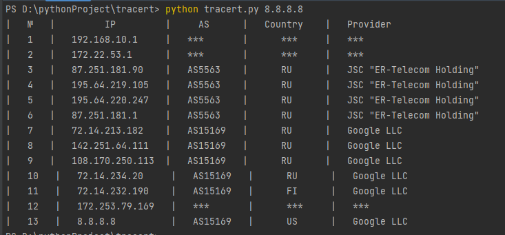

# Трассировка автономных систем #
## Постановка задачи: ##
Пользователь вводит доменное имя
или IP адрес. Осуществляется трассировка до указанного узла (например, с использованием
tracert), т. е. мы узнаем IP адреса маршрутизаторов, через которые проходит пакет. Необходимо определить к какой автономной системе относится каждый из полученных IP адресов
маршрутизаторов. Для определения номеров автономных систем обращаться к базам данных
региональных интернет регистраторов.
Выход: для каждого IP-адреса – вывести результат трассировки (или кусок результата до появления ***), для "белых" IP-адресов из него указать номер автономной системы.
## Использование: ##
~~~
python tracert.py доменное имя или IP-адрес
~~~
## Пример: ##
~~~
python tracert.py 8.8.8.8
~~~
__Результат:__  

## Видео пример работы скрипта: ##
+ https://youtu.be/QoXxi87KBKc

___Задачу выполнил: Матус Матвей КН-201(МЕН-210201)___